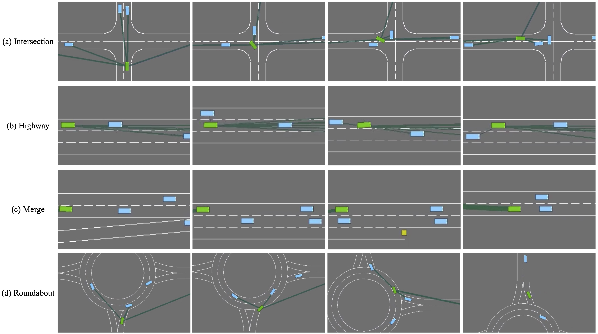

# COMP0124 Coursework: Efficient Social Attention for Autonomous Decision-Making in Varing Traffic Scenarios

This repository contains the source code for coursework paper: Efficient Social Attention for Autonomous Decision-Making in Varing Traffic Scenarios. The experiment environment is forked from: [HighwayEnv](https://github.com/Farama-Foundation/HighwayEnv) and [rl-agents](https://github.com/eleurent/rl-agents).  We modify the code to deploy our proposed method.
## Authors
He Liang, Jianheng Liu, Yunfan Shi

## Run the Code
To run the code, you may follow the instruction in `.\example.ipynb`.

## Modified Code Files
The code files we modified are as follows, which contain the implementation of our proposed method.
```
├── rl-agents
│   ├── rl_agents
│   │   ├── agents
│   │   │   ├── common
│   │   │   │   ├── models.py -> introduce sparse attention into the model
│   │   │   ├── deep_q_network
│   │   │   │   ├── pytorch.py -> introduce learnable weight for double q learning
│   ├── scripts
│   │   ├── configs
│   │   │   ├── HighwayEnv
│   │   │   │   ├── env_obs_attention.json          -> Configure the environment observation state
│   │   │   │   ├── agent
│   │   │   │   │   ├── DQNAgent
│   │   │   │   │   │   ├── ego_attention_2h.json   -> Set up the agent's algorithm model
│   │   │   ├── IntersectionEnv
│   │   │   │   ├── env_obs_attention.json
│   │   │   │   ├── agent
│   │   │   │   │   ├── DQNAgent
│   │   │   │   │   │   ├── ego_attention_2h.json
│   │   │   ├── MergeEnv
│   │   │   │   ├── env_obs_attention.json
│   │   │   │   ├── agent
│   │   │   │   │   ├── DQNAgent
│   │   │   │   │   │   ├── ego_attention_2h.json
│   │   │   ├── RoundaboutEnv
│   │   │   │   ├── env_obs_attention.json
│   │   │   │   ├── agent
│   │   │   │   │   ├── DQNAgent
│   │   │   │   │   │   ├── ego_attention_2h.json
```
## Results
The raw data and visualisations of the experiments can be found in the `.\experiments` folder and the demonstration videos can be found in the `.\videos` folder.


## License
Code: [MIT License](LICENSE)
